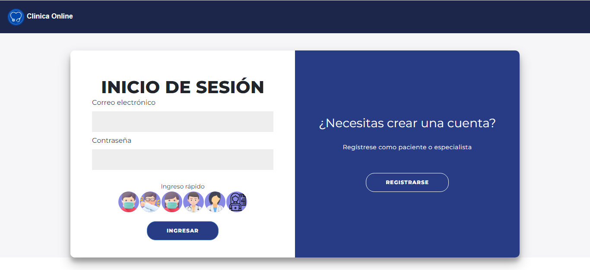
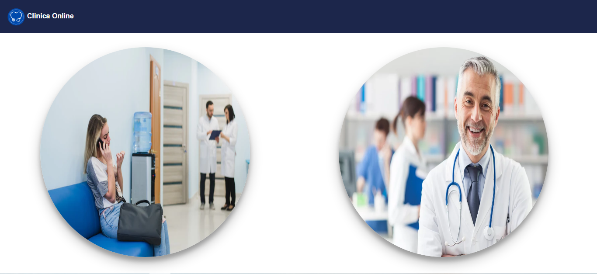
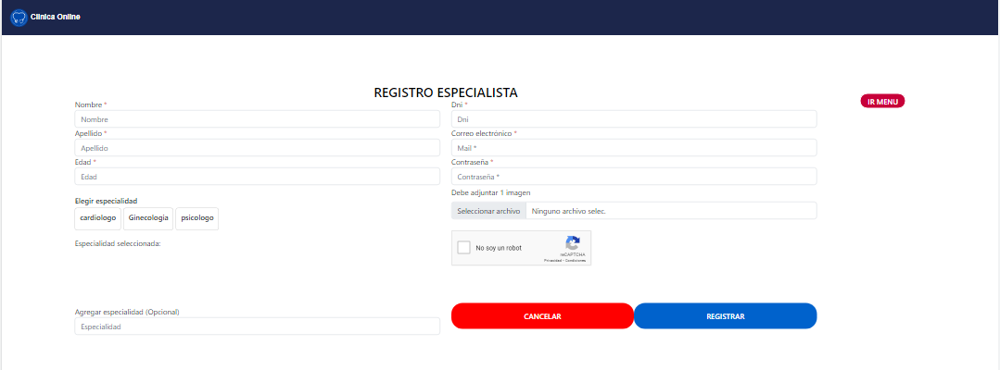
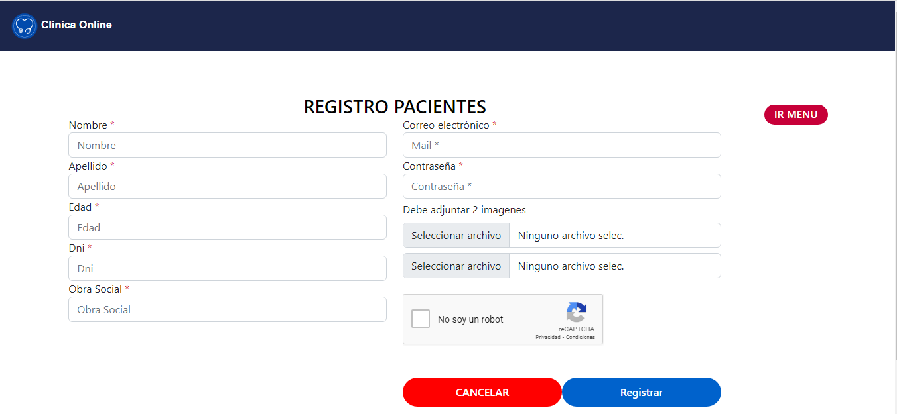
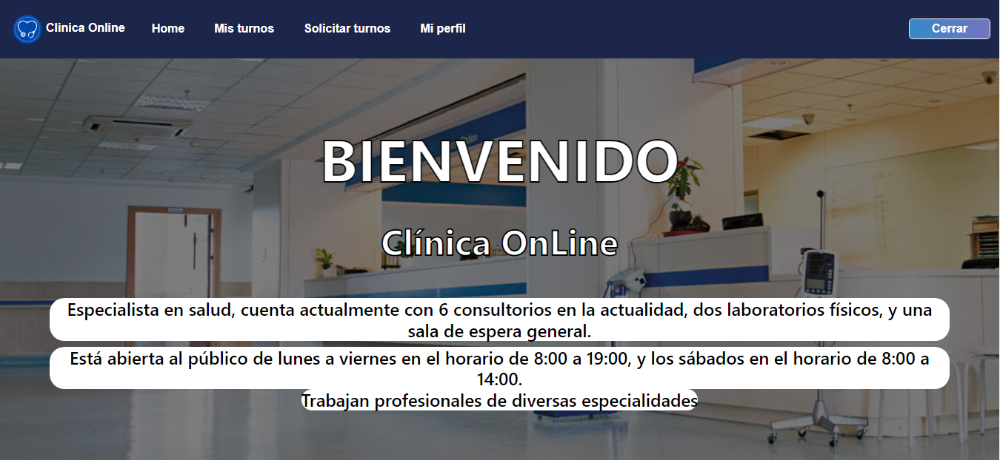

# ClinicaOnline
“La clínica OnLine, especialista en salud, cuenta actualmente con consultorios (6 en la actualidad),
dos laboratorios (físicos en la clínica), y una sala de espera general. Está abierta al público de lunes a
viernes en el horario de 8:00 a 19:00, y los sábados en el horario de 8:00 a 14:00.

Trabajan en ella profesionales de diversas especialidades, que ocupan los consultorios acorde a su
disponibilidad, y reciben en ellos pacientes con turno para consulta o tratamiento. Dichos turnos son
pedidos por la web seleccionando el profesional o la especialidad. La duración mínima de un turno es
30 minutos.”

## Log In

### Seleccion de registros: Paciente o Especialista

### Registro Especialista

### Registro Paciente

### Bienvenida

